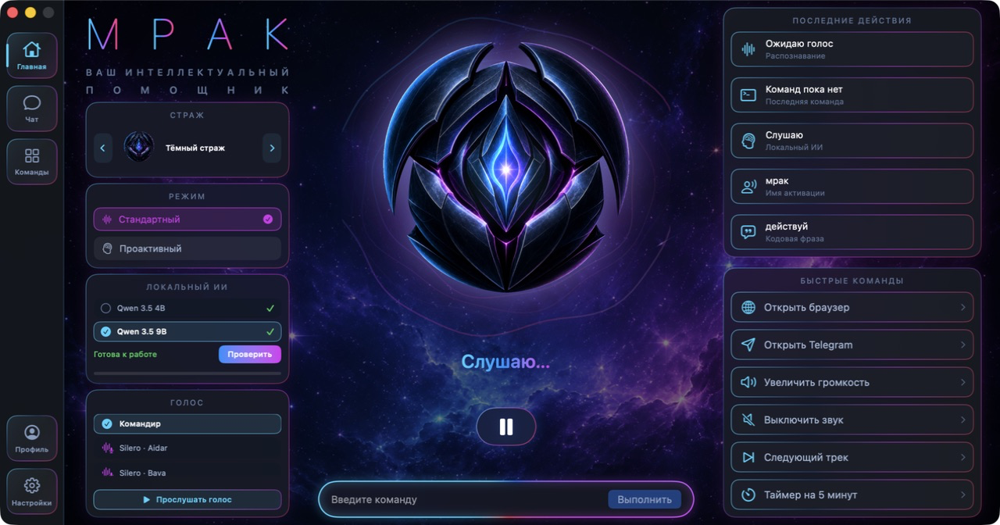
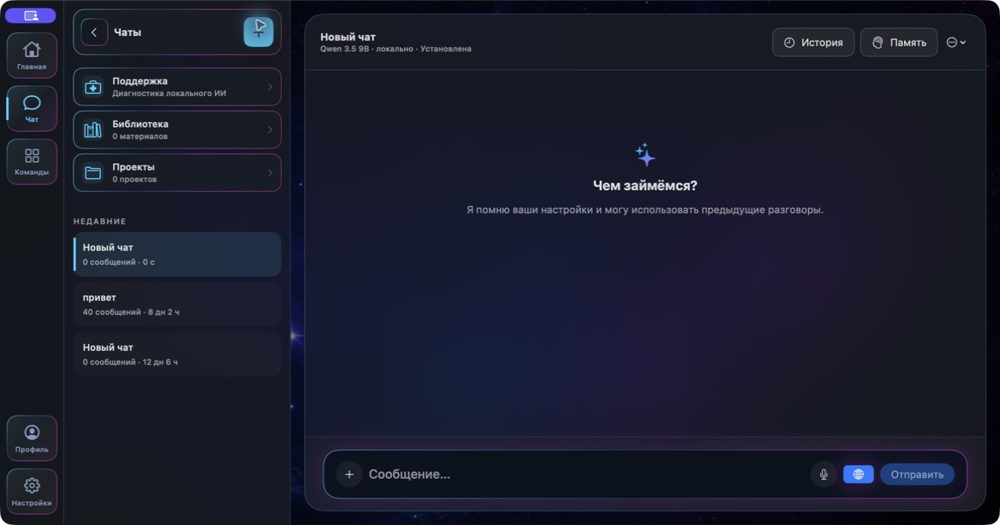
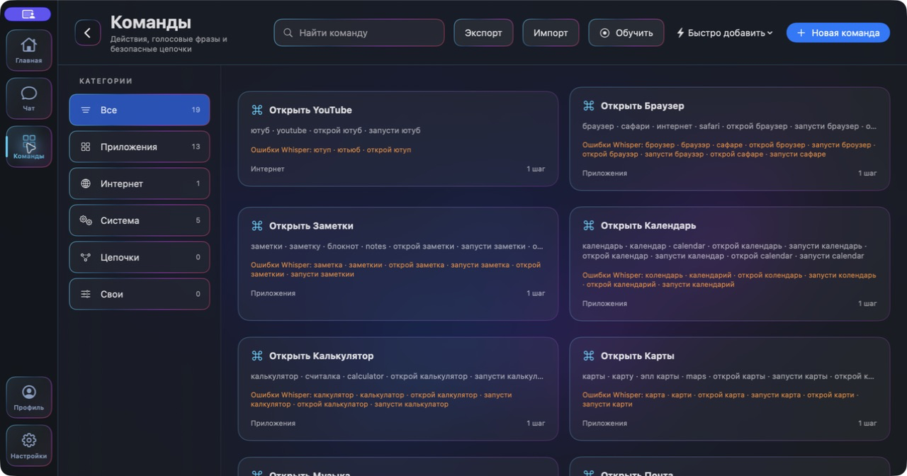
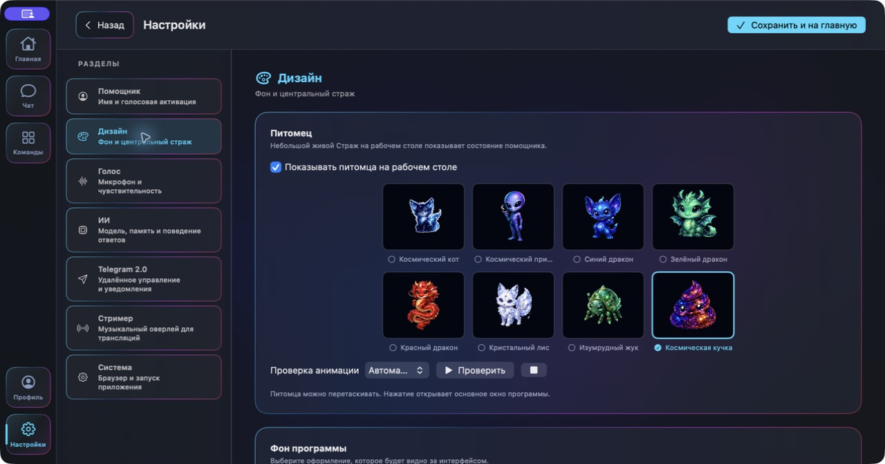
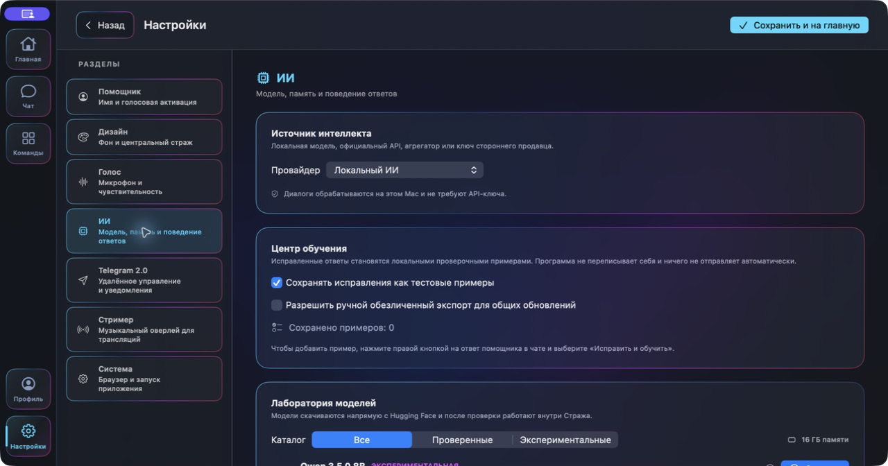

# Страж

Локальный голосовой AI-помощник для macOS.

Голосовое управление Mac, AI-чат, собственные команды, визуальные сценарии,
проекты, локальная база знаний и Telegram — в одном нативном приложении.

[Скачать](https://github.com/Hunter9568/Strazh-Releases/releases/latest) ·
[Возможности](#возможности) · [Установка](#установка) ·
[Терминал](#установка-через-terminal) · [Активация](#активация) ·
[Настройка](#первоначальная-настройка) · [Проблемы](#решение-проблем)

> Это официальный репозиторий установочных файлов. Исходный код, приватные
> ключи лицензирования и данные покупателей здесь не публикуются.

---

## О проекте

«Страж» — нативное приложение для Mac на Swift и SwiftUI. Помощник распознаёт
русскую речь локально через Whisper, озвучивает ответы, выполняет разрешённые
действия в macOS и может использовать как локальные, так и облачные AI-модели.

Приложение ориентировано не только на разговор: пользователь может создавать
свои голосовые команды из нескольких шагов, работать с документами и проектами,
управлять помощником через Telegram и персонализировать его внешний вид.

---

## Скриншоты

<table>
  <tr>
    <td width="50%" align="center">
      <a href="screenshots/01-main.png"></a><br>
      <b>Главный экран и голосовой помощник</b>
    </td>
    <td width="50%" align="center">
      <a href="screenshots/02-chat.png"></a><br>
      <b>AI-чат и веб-поиск</b>
    </td>
  </tr>
  <tr>
    <td width="50%" align="center">
      <a href="screenshots/03-commands.png"></a><br>
      <b>Голосовые команды и сценарии</b>
    </td>
    <td width="50%" align="center">
      <a href="screenshots/04-design.png"></a><br>
      <b>Персонализация и питомцы</b>
    </td>
  </tr>
  <tr>
    <td colspan="2" align="center">
      <a href="screenshots/05-ai-models.png"></a><br>
      <b>Локальный AI и лаборатория моделей</b>
    </td>
  </tr>
</table>

Нажмите на любой снимок, чтобы открыть его в полном размере.

---

## Возможности

| | Возможность | Что умеет «Страж» |
|---|---|---|
| 🎙️ | **Голос** | Локальное распознавание Whisper, кодовая фраза, ручной режим прослушивания и русская озвучка |
| 🧠 | **Локальный AI** | Модели LiteRT и llama.cpp работают непосредственно на Mac; поддерживаются текстовые и мультимодальные модели |
| ☁️ | **Облачный AI** | OpenAI, DeepSeek, Gemini, Anthropic Claude, VseLLM, OpenRouter, NVIDIA NIM, Bytez, Groq, Mistral, Together AI и сторонние OpenAI-совместимые API |
| 🆓 | **Каталог моделей** | «Страж» получает актуальный список моделей OpenRouter, NVIDIA NIM и Bytez, поддерживает поиск, фильтр бесплатных вариантов и сохраняет последний каталог для работы после перезапуска |
| 🤖 | **Codex** | Подключение Codex через подписку ChatGPT и выбор режима: разговор, помощник или агент |
| 💬 | **AI-чат** | Потоковые ответы, история диалогов, память, вложения изображений и документов, исправление и обучение на ответах |
| 🖥️ | **Управление macOS** | Запуск приложений, открытие сайтов, ввод текста, управление громкостью, воспроизведением и таймерами |
| ⚡ | **Свои команды** | Многошаговые сценарии, собственные голосовые фразы, варианты ошибок Whisper и тестовый запуск |
| 👁️ | **Визуальные сценарии** | Ожидание приложения, выбор элементов интерфейса, нажатия, заполнение полей и снимки окна для обучения |
| 🌐 | **Интернет** | Безопасное открытие URL и веб-поиск из голосовых команд и AI-чата |
| 📚 | **Локальная библиотека** | Хранение документов и веб-материалов для использования в качестве контекста |
| 📁 | **Проекты** | Отдельные рабочие пространства со своими чатами, инструкциями и материалами |
| ✈️ | **Telegram 2.0** | Управление через личного бота, текстовые и голосовые запросы, уведомления о загрузках и ежедневный отчёт |
| 🎨 | **Персонализация** | Фон, голос, имя и характер помощника, несколько образов, экранный питомец и собственные реплики |
| 🎬 | **Режим стримера** | Отдельный оверлей помощника для трансляций и отображения текущей активности |
| 🚀 | **Работа в фоне** | Меню в строке macOS, запуск вместе с системой и остановка текущей команды |
| 🛡️ | **Безопасность действий** | Разрешённый набор инструментов, проверка сценариев и подтверждение чувствительных операций |
| 🔐 | **Защита секретов** | API-ключи и Telegram-токен сохраняются в системной Связке ключей, а не в открытых настройках |
| 🔑 | **Лицензия** | Индивидуальный подписанный код с привязкой к одному Mac и защитой Secure Enclave при наличии |
| 🔄 | **Обновления** | Проверка криптографически подписанного манифеста перед предложением новой версии |

### Режимы AI

| Режим | Интернет | Где обрабатывается запрос | Что требуется |
|---|---:|---|---|
| **Локальная модель** | Опционально | Модель работает на Mac; при включённом веб-поиске приложение получает результаты из DuckDuckGo и передаёт их модели как контекст | Скачать совместимую модель; интернет нужен только для загрузки, поиска и обновлений |
| **Ollama** | Только для установки модели | На вашем Mac | Установленный Ollama |
| **Codex** | Да | Сервис OpenAI | Подписка ChatGPT и установленный Codex |
| **Облачный провайдер** | Да | У выбранного провайдера | Собственный API-ключ |

---

## Системные требования

| Компонент | Требование |
|---|---|
| Компьютер | Mac с Apple Silicon: M1, M2, M3, M4 и новее |
| macOS | 14 или новее |
| Оперативная память | От 8 ГБ; для крупных локальных моделей рекомендуется 16 ГБ и больше |
| Диск | Не менее 2 ГБ для приложения; локальные модели требуют дополнительное место |
| Интернет | Не нужен для базового локального голоса; нужен для загрузки моделей, обновлений и облачного AI |

Версия 0.9.0 предназначена только для macOS на Apple Silicon. Windows, Linux и
Intel Mac этой сборкой не поддерживаются.

---

## Установка

### Обычный способ

1. Откройте [последний релиз](https://github.com/Hunter9568/Strazh-Releases/releases/latest).
2. Раскройте блок **Assets**.
3. Скачайте файл `Strazh-0.9.0-arm64.dmg`. Файл с окончанием `.sha256`
   скачивать для установки не обязательно.
4. Откройте DMG и перенесите «Страж» в папку «Программы».
5. Запустите приложение из папки «Программы».

### Установка через Terminal

Скачать установщик командой:

```bash
curl -fL \
  https://github.com/Hunter9568/Strazh-Releases/releases/download/v0.9.0/Strazh-0.9.0-arm64.dmg \
  -o "$HOME/Downloads/Strazh-0.9.0-arm64.dmg"
open "$HOME/Downloads/Strazh-0.9.0-arm64.dmg"
```

После открытия образа перенесите «Страж» в «Программы». Полностью установить в
личную папку `~/Applications` можно так:

```bash
mkdir -p "$HOME/Applications"
hdiutil attach "$HOME/Downloads/Strazh-0.9.0-arm64.dmg" -nobrowse
ditto "/Volumes/Страж 0.9.0/Страж.app" "$HOME/Applications/Страж.app"
hdiutil detach "/Volumes/Страж 0.9.0"
open "$HOME/Applications/Страж.app"
```

Команды не отключают защиту macOS и не удаляют карантинный атрибут.

### Первый запуск без Apple Developer ID

Текущая сборка распространяется без платного сертификата Apple Developer ID.
Если macOS заблокирует первый запуск:

1. Попробуйте открыть «Страж» обычным способом.
2. Откройте **Системные настройки → Конфиденциальность и безопасность**.
3. Найдите сообщение о заблокированном приложении «Страж».
4. Нажмите **Всё равно открыть** и подтвердите действие паролем Mac.

Не отключайте Gatekeeper и не выполняйте команды `xattr`, найденные в интернете.

---

## Активация

Одна покупка активирует один Mac.

1. Откройте вкладку **Профиль**.
2. Нажмите **Скопировать запрос устройства**.
3. После оплаты отправьте запрос продавцу.
4. Полученный индивидуальный код вставьте в поле активации.
5. Нажмите **Активировать**.

Код содержит подписанные данные лицензии и подходит только соответствующему
устройству. Для переноса лицензии потребуется предварительно отвязать старый Mac.

---

## Первоначальная настройка

| Шаг | Что сделать | Для чего требуется |
|---:|---|---|
| 1 | Разрешить доступ к микрофону | Голосовые команды и диктовка |
| 2 | Разрешить распознавание речи, если запросит macOS | Обработка голосового ввода |
| 3 | Разрешить Универсальный доступ | Ввод текста, сочетания клавиш и визуальные сценарии |
| 4 | Выбрать локальный или облачный AI | Ответы в чате и интеллектуальные команды |
| 5 | Настроить имя и кодовую фразу | Персональная голосовая активация |
| 6 | При необходимости включить запуск с macOS | Работа помощника после входа в систему |

### Примеры голосовых команд

| Задача | Пример фразы |
|---|---|
| Запустить приложение | «Открой Telegram» |
| Открыть сайт | «Открой сайт GitHub» |
| Найти информацию | «Найди в интернете погоду в Москве» |
| Управлять звуком | «Сделай громче», «Выключи звук» |
| Управлять музыкой | «Пауза», «Следующий трек» |
| Поставить таймер | «Поставь таймер на десять минут» |
| Подготовить сообщение | «Напиши в Telegram Даниле: буду через час» |

Фактическое распознавание зависит от выбранной кодовой фразы, микрофона и
созданных пользователем команд.

---

## Обновления

Откройте **Профиль → Обновления → Проверить обновления**. «Страж» загружает
публичный манифест и проверяет его цифровую подпись встроенным открытым ключом.
Если опубликована более новая версия, приложение покажет описание и официальную
ссылку для загрузки.

---

## Проверка установщика

SHA-256 версии 0.9.0:

```text
041e3cb54d16cf76e6bbabf2ebf4c9e845e94f9b3bd69528725875308f5c2196
```

Проверка скачанного файла:

```bash
shasum -a 256 "$HOME/Downloads/Strazh-0.9.0-arm64.dmg"
```

Результат должен полностью совпасть со значением выше. SHA-256 — это публичный
отпечаток файла, а не пароль и не ключ лицензии.

---

## Решение проблем

| Проблема | Решение |
|---|---|
| macOS сообщает, что разработчик не проверен | Используйте «Конфиденциальность и безопасность → Всё равно открыть» |
| Голос не слышит пользователя | Проверьте разрешение микрофона и выбранное устройство ввода |
| Команды не управляют интерфейсом | Разрешите «Стражу» Универсальный доступ в настройках macOS |
| Облачный AI не отвечает | Проверьте API-ключ, адрес сервиса, модель, баланс и подключение к интернету |
| Локальная модель не запускается | Проверьте свободное место и соответствие модели доступной памяти Mac |
| Код активации отклонён | Скопируйте новый запрос устройства и убедитесь, что код выпущен именно для него |
| Обновления не проверяются | Проверьте интернет; версия должна содержать адрес официального манифеста |

---

## Конфиденциальность и безопасность

- локальный Whisper обрабатывает запись на Mac;
- локальная AI-модель выполняет генерацию на Mac и не требует облачного AI-провайдера;
- если включён веб-поиск, приложение отправляет поисковый запрос в DuckDuckGo,
  получает заголовки и фрагменты результатов и передаёт их локальной модели как
  контекст; веб-поиск можно отключить кнопкой с глобусом в чате;
- при выборе облачного AI запрос передаётся выбранному пользователем сервису;
- API-ключи и Telegram-токен сохраняются в Keychain;
- Telegram принимает команды только от настроенного `chat_id`;
- чувствительные действия проходят проверку и подтверждение;
- приватный ключ выпуска лицензий не входит в приложение и не публикуется;
- репозиторий релизов не содержит исходный код и сведения о покупателях.

---

## Текущий статус

Версия 0.9.0 — первая тестовая сборка для ограниченного распространения. Перед
массовой продажей рекомендуется пилотное тестирование на нескольких Mac и
подписание приложения сертификатом Apple Developer ID.

«Страж» — персональный AI-помощник и центр автоматизации вашего Mac.
